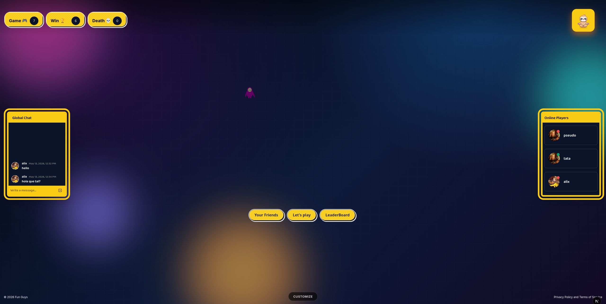
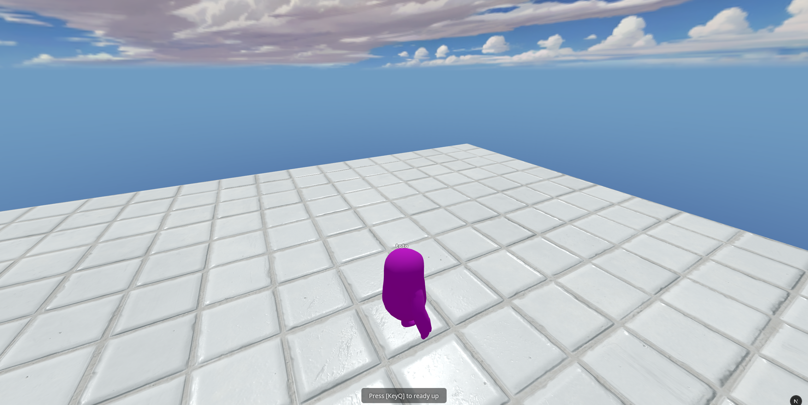
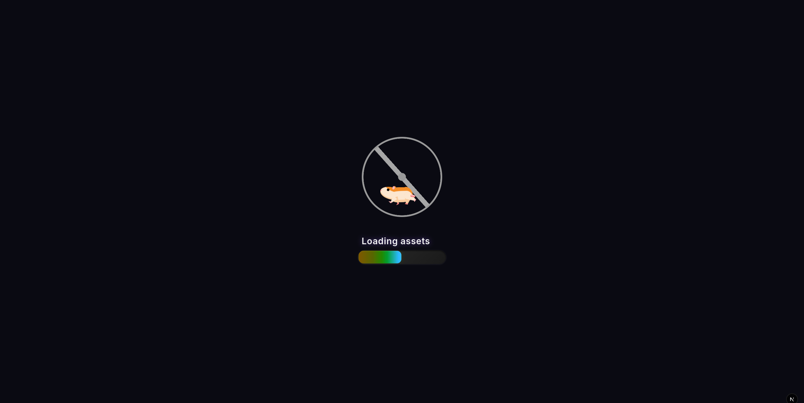
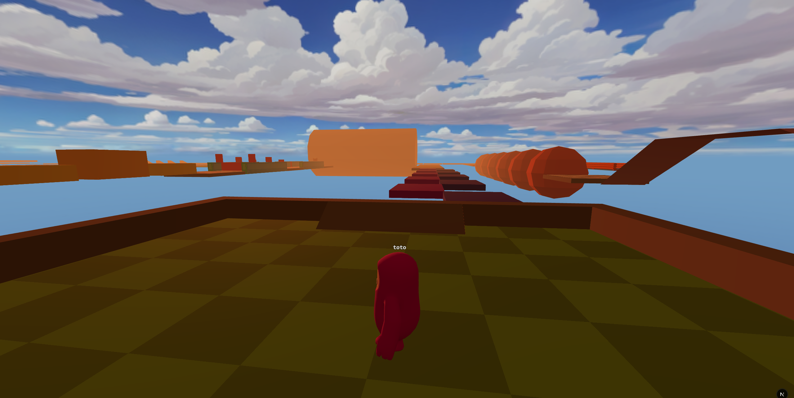
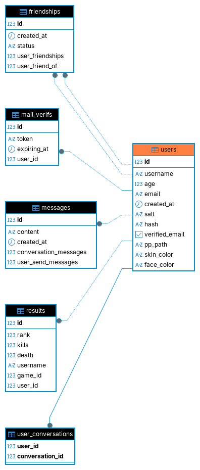

_This project has been created as part of the 42 curriculum by Alix, Tristan, Shiyan Guan, Edouard._

---

# Fun Guys — Multiplayer 3D Parkour Battle Royale

Fun Guys is a **real-time multiplayer 3D parkour battle royale** web game. Players compete in elimination rounds across dynamic 3D obstacle courses, with lobby phases, spectator support, in-game chat, character customization, and persistent game statistics. The game features a fully custom Three.js engine wrapper with physics (Rapier), a Bun WebSocket game server, and a Go REST API with Ent ORM.

---

## Description

Fun Guys delivers a competitive online gaming experience where up to dozens of players race through parkour maps. Each round eliminates bottom performers, and the lobby loops until a single winner remains. The project demonstrates a full-stack architecture with real-time WebSocket communication, advanced 3D graphics, a custom game engine abstraction, and a comprehensive user management system.






### Key Features

- **3D parkour gameplay** — Three.js with custom engine wrapper, Rapier physics, GLTF/GLB assets
- **Real-time multiplayer** — WebSocket-based game server handling position sync, emotes, events
- **Lobby sequencer** — Configurable phase-based lobbies (wait → game → results → loop/end) with YAML configs
- **Character customization** — Body, face, and eye color customization persisted to backend
- **In-game emote system** — 20+ animations triggered via keybinds and synced over network
- **User authentication** — Email/password with salted hashing + 42 OAuth
- **Profile management** — Avatar upload, username/email/age updates
- **Friend system** — Send/accept/reject/delete friend requests, friend list
- **Real-time chat** — WebSocket-based 1-on-1 and group conversations with online user tracking
- **Game statistics** — Per-user win/loss/kill/death tracking, averages, rankings
- **Leaderboard** — Recent games and results display
- **Spectator mode** — Watch ongoing games with free-fly camera
- **PWA support** — Installable with manifest and service worker
- **Privacy Policy & Terms of Service** — Accessible via footer modal

---

## Technical Stack

| Layer | Technology | Justification |
|---|---|---|
| **Frontend** | Next.js 15 (React framework) | Full-stack React framework with SSR/SPA hybrid, file-based routing, and built-in optimizations |
| **3D Engine** | Three.js + Rapier (custom ThreeWrapper) | Immersive 3D environment with physics simulation and modular engine abstraction |
| **Styling** | Tailwind CSS + Radix UI + Framer Motion | Utility-first CSS for rapid development + accessible headless UI primitives + animation library |
| **Backend API** | Go + Chi router + Huma v2 | Type-safe REST API with OpenAPI docs, DI container (samber/do), clean architecture |
| **ORM** | Ent (entgo.io) | Code-gen ORM with type safety, migration support, and clear schema definitions |
| **Database** | PostgreSQL 17 | Reliable relational DB with strong ACID compliance for game data and user management |
| **Game Server** | Bun + TypeScript WebSocket | Lightweight, high-performance WebSocket server with YAML-driven lobby sequencer |
| **Auth** | JWT (lestrrat-go/jwx) + bcrypt-style hashing | Stateless auth with RS256-signed tokens and salted password hashing |
| **Containerization** | Docker Compose | Single-command deployment for all services (frontend, game server, API, database) |

### Database Schema



```
User
├── id (int, PK)
├── username (string, unique)
├── email (string, unique)
├── age (int)
├── salt (string)
├── hash (string)
├── verified_email (bool)
├── pp_path (string)          # profile picture path
├── skin_color (string)
├── face_color (string)
├── created_at (timestamp)
├── ── MailVerif (1:1)        # email verification token
├── ── Friendship (1:N)       # sent friend requests
├── ── FriendOf (1:N)         # received friend requests
├── ── SendMessages (1:N)     # messages sent
├── ── Conversations (M:N)    # conversation participants
└── ── Results (1:N)          # game results

Friendship
├── id (int, PK)
├── user_id (int, FK → User)
├── friend_id (int, FK → User)
├── status (string: pending/accepted)
├── created_at (timestamp)
└── UNIQUE(user_id, friend_id)

Conversation
├── id (int, PK)
├── is_group (bool)
├── title (string, optional)
├── created_at (timestamp)
├── ── Messages (1:N)
└── ── Participants (M:N → User)

Message
├── id (int, PK)
├── conversation_id (int, FK → Conversation)
├── sender_id (int, FK → User)
├── content (string)
└── created_at (timestamp)

Game
├── id (int, PK)
├── type (string)             # lobby config name
├── nb_player (int)
├── time_stamp (timestamp)
└── ── Results (1:N)

Result
├── id (int, PK)
├── game_id (int, FK → Game)
├── user_id (int, FK → User)
├── username (string)
├── rank (int)
├── kills (int)
└── death (int)

MailVerif
├── id (int, PK)
├── user_id (int, FK → User, unique)
├── token (string)
└── expiring_at (timestamp)
```

---

## Instructions

### Prerequisites

- Docker & Docker Compose
- Node.js 20+ / Bun (for local development)
- Go 1.26+ (for backend development)

### Environment Setup

Copy the example env file and adjust values:

```bash
cp .env.dev.example .env
```

For production, use `.env.prod.example` and configure domain names, TLS certificates, and secrets.

### Run with Docker (recommended)

```bash
docker compose up --build
```

This starts all four services:

| Service | Port | Description |
|---|---|---|
| `web` (frontend) | 3001 → 3000 | Next.js dev server |
| `game-server` | 3002 → 3000 | Bun WebSocket game server |
| `api` (backend) | 8080 | Go REST API |
| `db` | 5432 | PostgreSQL 17 |

### Local Development (without Docker)

```bash
# Backend
cd backend && go run ./cmd/api

# Game server
cd server && bun install && bun src/index.ts

# Frontend
cd front && bun install && bun dev
```

### Create Demo Users

```bash
./create_demo_users.sh
```

---

## Features List

| Feature | Description | Team Member(s) |
|---|---|---|
| **3D Engine (ThreeWrapper)** | Custom Three.js abstraction with render loop, worlds, modules, environments, physics | Edouard |
| **Parkour Game World** | 3D parkour gameplay with win zones, checkpoints, countdown, ragdoll physics | Edouard |
| **WebSocket Game Server** | Bun server with tick loop, position sync, lobby sequencer, phase management | Edouard |
| **Lobby System** | YAML-configurable lobby sequences (wait → game → results → loop/end), configs: `one_game`, `battle_royale` | Edouard |
| **Character Customization** | Body/face/eye color picker with API persistence | Edouard |
| **Emote System** | 20+ key-triggered animations synced over network | Edouard |
| **Spectator Mode** | Free-fly camera for eliminated players | Edouard |
| **Custom Design System** | 10+ reusable UI components (buttons, cards, inputs, dialogs, inputs-group, textareas, separators, sparkles, avatar, charts) with consistent color palette and typography | Alix |
| **Multi-browser Support** | Compatible with Chrome, Firefox, Safari, and Edge | Alix |
| **User Auth (email/password)** | Registration, login, salted password hashing, JWT tokens | Tristan |
| **42 OAuth** | Login via 42 Intranet OAuth 2.0 | Tristan |
| **User CRUD API** | Create, read, update, delete users; profile picture upload | Tristan |
| **Profile Management** | Update username, email, age, avatar; find users by ID/email/username | Tristan |
| **Friend System** | Send/accept/reject/delete friend requests, friend list | Alix |
| **Real-time Chat** | WebSocket-based 1-on-1 and group conversations with online presence | Shiyan Guan, Alix |
| **Leaderboard** | Recent games and results overview | Alix |
| **Game Customization** | Power-ups, different maps/themes, character colors, configurable lobby sequences | Edouard |
| **PWA Support** | Installable web app with manifest and icons | Alix |
| **Privacy Policy & ToS** | Accessible modal with comprehensive legal content | Alix |
| **UI Components** | Custom design system with buttons, cards, dialogs, inputs, modals, textareas | Alix |

---

## API Endpoints

The API is documented via OpenAPI/Swagger at `/docs`. Below are the implemented routes:

**Auth**
- `POST /api/auth/login` — Login with email/username + password
- `GET /api/auth/42/login` — Redirect to 42 OAuth
- `GET /api/auth/42/callback` — 42 OAuth callback
- `GET /api/auth/verify-email` — Email verification

**Users**
- `POST /api/users/add` — Register new user
- `GET /api/users` — List all users
- `GET /api/users/{id}` — Get user by ID
- `PUT /api/users/{id}` — Replace user (auth required)
- `PATCH /api/users/{id}` — Update user (auth required)
- `DELETE /api/users/delete` — Delete user (admin only)
- `GET /api/users/me` — Get current user (auth required)
- `GET /api/users/find` — Find user by query (id/email/username)

**Profile**
- `PUT /api/update/profile-picture` — Upload profile picture (auth required)
- `GET /api/users/me/profile-picture` — Get own picture (auth required)
- `GET /api/users/{id}/picture` — Get user picture by ID

**Friends**
- `POST /api/friends/request` — Send friend request (auth required)
- `PATCH /api/friends/accept` — Accept friend request (auth required)
- `DELETE /api/friends/reject` — Reject friend request (auth required)
- `DELETE /api/friends/delete` — Remove friend (auth required)
- `GET /api/friends/friendlist` — Get friends list (auth required)
- `GET /api/friends/pending` — Get pending requests (auth required)
- `GET /api/friends/sent` — Get sent requests (auth required)

**Chat**
- `GET /api/chat/ws` — WebSocket chat connection (auth via cookie)
- `POST /api/chat/conversation` — Create/get 1-on-1 conversation (auth required)
- `POST /api/chat/group-conversation` — Create group conversation (auth required)
- `GET /api/chat/conversations` — Get user conversations (auth required)
- `GET /api/chat/conversation/{id}/messages` — Get conversation history (auth required)
- `POST /api/chat/group-conversation/{id}/join` — Join group (auth required)
- `POST /api/chat/group-conversation/{id}/participants` — Add participants (auth required)
- `DELETE /api/chat/group-conversation/{id}/leave` — Leave group (auth required)
- `GET /api/chat/online` — Get online users (auth required)

**Games**
- `POST /api/game/add` — Record game results (admin key required)
- `GET /api/users/{id}/games` — Get user match history
- `GET /api/users/{id}/stats` — Get user statistics
- `GET /api/games` — List recent games
- `GET /api/results` — List recent results
- `GET /api/games/results` — Get games with results

---

## Modules

| Module | Type | Points | Justification | Team Member(s) |
|---|---|---|---|---|
| **Web: Use frameworks (frontend + backend)** | Major | 2 | Next.js for frontend, Go + Chi/Huma for backend — a full-stack framework pair with type-safe OpenAPI integration | Tristan, Edouard |
| **Web: Real-time features via WebSocket** | Major | 2 | Game server streams player positions and game events via WebSocket at 50ms intervals; chat uses WebSocket for instant messaging | Edouard, Shiyan Guan |
| **Web: User interaction (chat, profiles, friends)** | Major | 2 | Complete user ecosystem with real-time chat (1-on-1 and group), profile pages, friend management system | Alix, Shiyan Guan, Tristan |
| **Web: Public API with 5+ endpoints** | Major | 2 | 28+ REST endpoints across auth/users/friends/chat/games with OpenAPI docs, admin key security, and JWT auth | Tristan, Biny17 |
| **Gaming: Complete web-based game** | Major | 2 | Full 3D parkour game with physics (Rapier), win conditions, elimination mechanics, configurable maps | Edouard |
| **Gaming: Remote players** | Major | 2 | Multiple players on separate machines connect via WebSocket; position/rotation/emotes synced in real-time | Edouard |
| **Gaming: Multiplayer 3+** | Major | 2 | Battle royale lobby supports unlimited concurrent players with dynamic game mode selection | Edouard |
| **Gaming: Advanced 3D graphics** | Major | 2 | Custom ThreeWrapper engine with GLTF/GLB assets, Rapier physics, modular environments, particle effects, lighting | Edouard |
| **Web: ORM** | Minor | 1 | Ent (entgo.io) provides type-safe code-gen ORM with schema-as-code, migrations, and graph queries | Tristan, Biny17 |
| **Web: PWA** | Minor | 1 | manifest.json, app icons, apple-touch-icon, metadata for installable web app | Alix |
| **Web: Custom-made design system** | Minor | 1 | 10+ reusable UI components (Button, Card, Input, Textarea, Dialog, Avatar, Separator, Sparkles, Chart, InputGroup) with consistent Tailwind palette and custom typography | Alix |
| **Web: Support for additional browsers** | Minor | 1 | Full compatibility with Chrome, Firefox, Safari, and Edge; tested across all four | Alix |
| **User: Standard user management** | Minor | 1 | Profile update, avatar upload with file validation, friends with online status, profile pages | Tristan, Alix |
| **User: OAuth 2.0** | Minor | 1 | 42 Intranet OAuth 2.0 with automatic account creation and Global chat enrollment | Tristan |
| **Gaming: Spectator mode** | Minor | 1 | Eliminated players enter free-fly spectator camera; spectated games update in real-time | Edouard |
| **Gaming: Game customization** | Minor | 1 | In-game power-ups, different maps/themes (parkour1, parkour2, lobby1), customizable character colors, configurable lobby sequences | Edouard |

**Total: 8 Major (16pts) + 8 Minor (8pts) = 24 points**

---

## Project Management

### Team Organization

| Member | Role(s) | Responsibilities |
|---|---|---|
| **Edouard** | Product Owner, Project Manager / Developer | Architecture design, 3D engine (ThreeWrapper), game server, lobby sequencer, game worlds, network sync, character customization, emotes, spectator mode |
| **Alix** | Developer | Frontend UI/UX, PWA, friend system, leaderboard, character controls, responsive design, privacy/legal pages, component library, multi-browser support |
| **Tristan** | Tech Lead / Developer | Backend API architecture, user auth (email + 42 OAuth), user CRUD, profile pictures, game statistics, match history, admin middleware, demo user scripts |
| **Shiyan Guan** | Developer | Real-time chat system (WebSocket hub, group conversations, online presence), chat integration |

### Work Organization

- **Task tracking**: GitHub Issues for feature planning and bug tracking
- **Communication**: Discord for daily standups and coordination
- **Workflow**: Feature branches → PR → code review → merge; backend and frontend developed in parallel with regular integration merges
- **Architecture**: Tech Lead defined the ThreeWrapper engine architecture, module system, and world lifecycle; backend architecture designed collaboratively
- **Code reviews**: Critical changes (game server, auth, database schema) reviewed by at least one other team member

### Individual Contributions

**Edouard** — Engineered the entire 3D game engine (ThreeWrapper) with its world/module/environment system, Rapier physics integration, and GLTF loader. Built the Bun WebSocket game server with tick loop, position sync, and the YAML-configurable lobby sequencer supporting multi-round battle royale. Developed parkour gameplay mechanics (win zones, checkpoints, countdowns, ragdoll), character customization with color PBR materials, 20+ key-triggered emotes synced over network, spectator free-fly camera, and the map editor with component system.

**Alix** — Built the main frontend UI including the home page, login page, and all navigation components with Framer Motion animations and responsive design. Implemented the PWA manifest and metadata for installability. Developed the friend system UI (cards, lists, requests), leaderboard display, real-time chat interface integration, character controls panel, and the Privacy Policy & Terms of Service modals with comprehensive content.

**Tristan** — Product Owner and backend developer. Designed and implemented the Go backend architecture with Chi router, Huma v2 API framework, and Ent ORM integration. Built the authentication system (JWT with RS256, salted password hashing, cookie-based sessions). Implemented 42 OAuth 2.0 flow with auto-account creation and Global chat enrollment. Developed the complete user CRUD API, profile picture upload with file validation and MIME type detection, and the admin middleware with credential-based access. Built the game statistics and match history API service with wins/kills/deaths tracking and ranking. Implemented the Game and Result Ent schemas. Created the demo user setup script. Contributed to backend testing and dependency injection.

**Shiyan Guan** — Built the real-time WebSocket chat system including the hub/client architecture, WebSocket upgrade with JWT auth verification, 1-on-1 and group conversation management, online user presence tracking, conversation history with pagination, and participant management (add/remove/join/leave group conversations).

---

## Resources

- [Three.js Documentation](https://threejs.org/docs/) — 3D rendering library
- [Rapier 3D](https://rapier.rs/docs/user_guides/javascript/getting_started_js) — Physics engine
- [Next.js Documentation](https://nextjs.org/docs) — React framework
- [Ent ORM Documentation](https://entgo.io/docs/getting-started) — Go entity framework
- [Huma API Framework](https://huma.rocks/) — Type-safe REST API for Go
- [Go Chi Router](https://github.com/go-chi/chi) — Lightweight HTTP router
- [Bun](https://bun.sh/) — JavaScript runtime & toolchain
- [Tailwind CSS](https://tailwindcss.com/docs) — Utility-first CSS framework
- [Radix UI](https://www.radix-ui.com/) — Headless UI primitives
- [Framer Motion](https://www.framer.com/motion/) — Animation library for React

### AI Usage

AI tools (Claude, Copilot) were used to assist with:
- **Code generation**: Boilerplate for REST API handlers, Ent schema queries, React components, and TypeScript type definitions
- **Debugging**: Identifying root causes of WebSocket desync issues, physics collision detection bugs, and race conditions in the lobby sequencer
- **Documentation**: Drafting the Privacy Policy and Terms of Service content, README structure
- **Code review**: Suggesting optimizations for render loop performance and database query efficiency

All AI-generated code was reviewed, tested, and understood by team members before integration.
